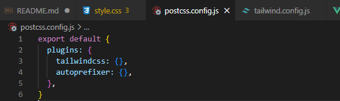
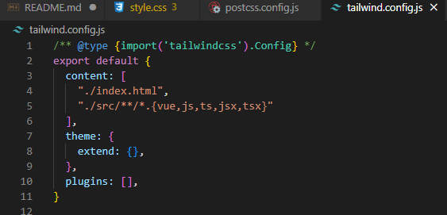
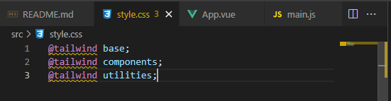
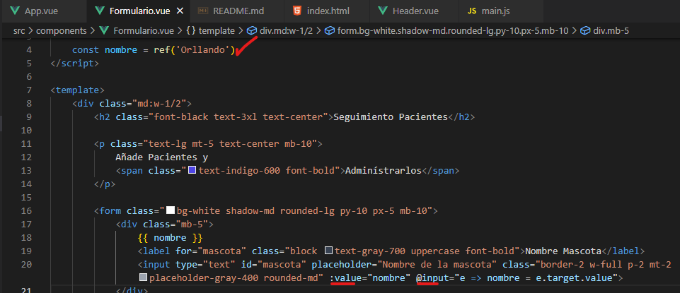
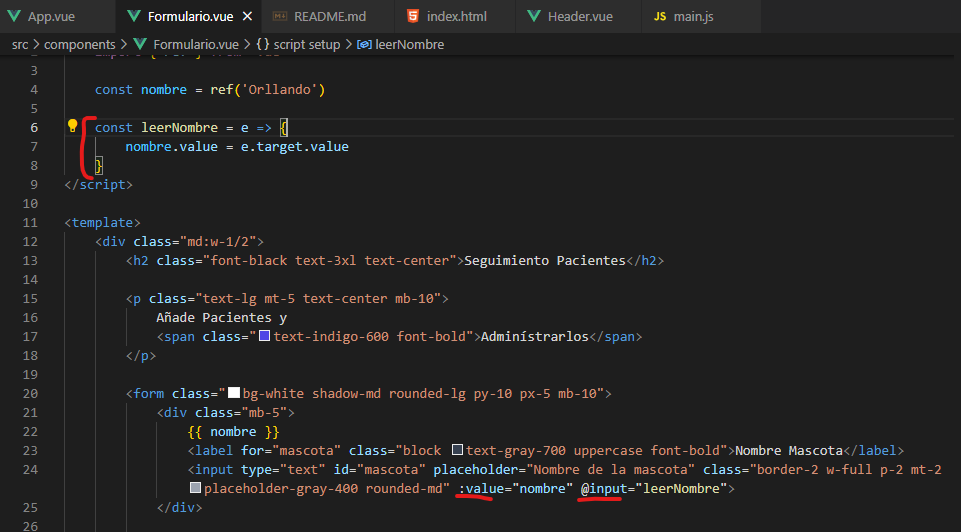
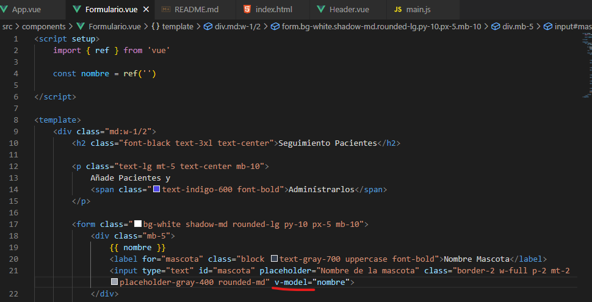

# Vue 3 + Vite

This template should help get you started developing with Vue 3 in Vite. The template uses Vue 3 `<script setup>` SFCs, check out the [script setup docs](https://v3.vuejs.org/api/sfc-script-setup.html#sfc-script-setup) to learn more.

## Recommended IDE Setup

- [VS Code](https://code.visualstudio.com/) + [Volar](https://marketplace.visualstudio.com/items?itemName=Vue.volar) (and disable Vetur) + [TypeScript Vue Plugin (Volar)](https://marketplace.visualstudio.com/items?itemName=Vue.vscode-typescript-vue-plugin).

## Pasos para la creación del proyecto.

Paso 1:
npm create vite@latest admin-pacientes -- --template vue

Paso 2:
cd admin-pacientes
npm install
npm run dev

## Configurando Tailwindcss.
Instalamos tailwindcss con el siguiento comando:
npm install -D tailwindcss postcss autoprefixer 

Inicializamos tailwindcss con el siguiente comando:
npx tailwindcss init -p

Nos va a generar dos archivos:

En el siguiente archivo tenemos que ponerle los archivos que van a contener tailwindcss

En nuestro archivo Style agregarle las siguientes lineas de codigo y ya con eso podemos usar tailwindcss.

## Leyendo datos ingresados a los inputs Vue js.
Existen dos maneras para ingresar leer los datos de los inputs en vue js.

La primera: Handle Inline

La segunda: Handle Method.

### Simplificar la lectura de un input con v-model.
Pero todo esto se puede simplificar con un simple v-model, ejemplo:

## Recomendaciones para el State en Vue.js

Si bien el State es una API sencila en Vue.js, puede llegar a dar ciertos problemas especialmente cuando hay que compartir información con otros componentes.

La recomendación principal para manejar el State es: Inicia local y en caso de necesitar ese State en diferentes componentes moverlo hacia el padre.

## Generando un ID para cada paciente.
Descargamos la libreria de UID.

npm install uid